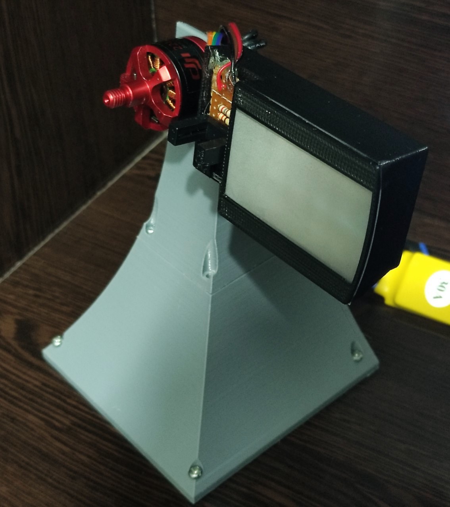

# Nipkow
A electromechanical display based on the Nipkow Disk, an early image-scanning technology. This project involves designing and building a high-speed LED-based Nipkow disk, displaying simple images using an STM32 microcontroller.

## BoM
- STM32F103 / Blue Pill (x1)
- 5050 RGB LEDs (x15)
- 2N2222 transistors (x6)
- Less than 300g of filament for 3D printing
- Brushless motor (DJI 2212 used in this project)
- 30A speed controller
- 10mm × 3mm screws and nuts (x20)
- Ribbed brass nuts, 4.5mm × 8mm, M3 (x7)

## Software Requirements
- **ARM GCC Toolchain**: To compile the [Zenith](https://github.com/empitrix/zenith) interface code
- **Python**: To convert `.gif` files to `.c` files
- [**FFmpeg**](https://github.com/ffmpeg/ffmpeg): To process frames of the given `.gif` file
- **CMake** & **Make**

### Python Libraries
- [`OpenCV`](https://pypi.org/project/opencv-python/): Process images
- [`colorist`](https://pypi.org/project/colorist/): Used to display image frames in the terminal


## Build
Clone and compile the project using CMake and `gcc-none-eabi-arm`:
```bash
git clone https://github.com/empitrix/nipkow && cd ./nipkow
make
```
To flash the program onto the STM32, simply navigate to the `./Release` folder and use the following command:

```bash
make flash
```

## 3D Models & Resources
All 3D models are available in this repository. You can use them to build your own Nipkow Disk Display.


## Preview




